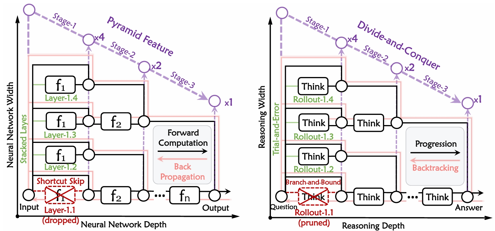
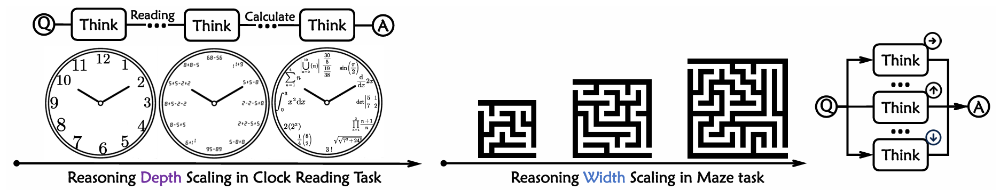
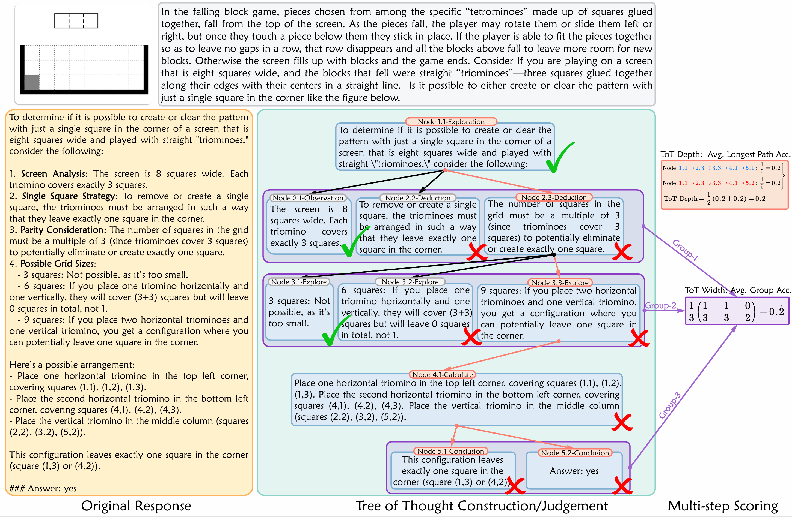

<h1>
  
  Think 360°: Evaluating the Width-centric Reasoning Capability of MLLMs Beyond Depth
</h1>

[[`Paper`](https://arxiv.org/abs/2603.22689)]
[[`Dataset`](https://huggingface.co/datasets/Walnutes/Think360)]
[[`BibTeX`](#citation)]
[[`License`](https://opensource.org/licenses/Apache-2.0)]

</div>

## 🔥 News
<a id="news"></a>

- **[2026-03-24]**: Our paper is now accessible at [arXiv](https://arxiv.org/abs/2603.22689).

## 🔍 Think360
<a id="think360"></a>

In this paper, we present a holistic multimodal benchmark that evaluates the reasoning capabilities of multimodal large language models (MLLMs) with an explicit focus on reasoning `width`, a complementary dimension to the more commonly studied reasoning `depth`. Specifically, reasoning depth measures the model’s ability to carry out long-chain, sequential reasoning in which each step is tightly and rigorously linked to the next. Reasoning width, in contrast, focuses on the model’s capacity for broad trial-and-error search or multi-constrained optimization: it must systematically traverse many possible and parallelized reasoning paths, apply diverse constraints to prune unpromising branches, and identify valid solution routes for efficient iteration or backtracking. To achieve this, we carefully curate over 1,200 high-quality multimodal cases spanning heterogeneous domains, and propose a fine-grained tree-of-thought evaluation protocol that jointly quantifies reasoning *width* and *depth*. We evaluate **12** major model families (over **30** advanced MLLMs) across difficulty tiers, question types, and required skills. Results show that while current models exhibit strong performance on general or common-sense VQA tasks, they still struggle to combine deep sequential thought chains with wide exploratory search to perform genuine insight-based reasoning. Finally, we analyze characteristic failure modes to provide possible directions for building MLLMs that reason not only *deeper* but also *wider*.

<div align="center">
<table>
<tr>
<td align="center">

<br><strong>Illustration for the <code>width</code> and <code>depth</code> in the information propagation process of neural network and reasoning</strong>
</td>
</tr>
<tr>
<td align="center">

<br><strong>Demonstration of the Scaling of Reasoning <code>Depth</code> & <code>Width</code></strong>
</td>
</tr>
</table>
</div>

## 🔮 Evaluation
<a id="evaluation"></a>

### 🔧 Dependency

Clone this repo and install packages:

```bash
git clone https://github.com/Walnutes/Think360 && cd Think360
pip3 install -r requirements.txt
```

### ⚡ Inference for Answer Prediction

Specify the following three key parameters: `json_path`, `image_dir`, `output_path_dir`.

<details>
<summary><strong>Close-source Models</strong></summary>

Set up API configuration:
```python
client = OpenAI(
    api_key="API_KEY", 
    base_url="BASE_URL",
)
```

Run inference:
```bash
MODEL="API_MODELS"
MODEL_NAME=${MODEL##*/}
MODEL_MAX_TOKENS=MAX_TOKENS

python ./api/eval_api.py --model "$MODEL" --model_max_tokens "$MODEL_MAX_TOKENS"
```

</details>

<details>
<summary><strong>Open-source Models</strong></summary>

<details>
<summary>InternVL with <code>LMDeploy</code></summary>

```bash
MODEL_PATH=/path/to/model

python internvl.py --model_path "$MODEL_PATH"
```

</details>

<details>
<summary>KiMi, MiMo, GLM and Qwen-series with <code>vLLM</code></summary>

We provide offline inference demos using both `transformers` and `vLLM`. We recommend using the `vLLM` OpenAI-compatible server:
```bash
export VLLM_MODEL_PATH=/path/to/model

CUDA_VISIBLE_DEVICES=0,1 python -m vllm.entrypoints.openai.api_server \
    --model $VLLM_MODEL_PATH \
    --trust-remote-code \
    --host 0.0.0.0 \
    --port 8008 \
    --tensor-parallel-size 2
```

</details>

</details>

### 📊 Postprocess for Answer Extraction & Justification

Run postprocessing:
```bash
PREDICTION_FILE="/path/to/prediction.json"
OUTPUT_FILE="/path/to/accuracy.json"

python /path/to/postprocess.py \
    --prediction_file "$PREDICTION_FILE" \
    --output_file "$OUTPUT_FILE"
```
### 🌳 Tree-of-Thought Evaluation

<div align="center">
<table>
<tr>
<td align="center">

<br><strong>Tree-of-Thought Evaluation Process</strong>
</td>
</tr>
</table>
</div>

To assess model performance along the dimensions of reasoning depth and breadth, we propose a Tree-of-Thought based evaluation method (ToT-Eval). ToT-Eval consists of three main steps:

**Step 1: Tree Extraction**:
```bash
python tree_extraction.py --input_file /path/to/prediction/model_prediction.json
```
**Step 2: Node Judgement** + **Step 3: Metric Calculation**:
```bash
python tree_judgement.py --input_file /path/to/prediction_tot/model_prediction_tot.json
```


## 📖 Citation
<a id="citation"></a>
If you find this benchmark useful in your research, please consider citing this BibTex:

```bibtex
@misc{chen2026think360degevaluatingwidthcentric,
      title={Think 360{\deg}: Evaluating the Width-centric Reasoning Capability of MLLMs Beyond Depth}, 
      author={Mingrui Chen and Hexiong Yang and Haogeng Liu and Huaibo Huang and Ran He},
      year={2026},
      eprint={2603.22689},
      archivePrefix={arXiv},
      primaryClass={cs.CV},
      url={https://arxiv.org/abs/2603.22689}, 
}

```